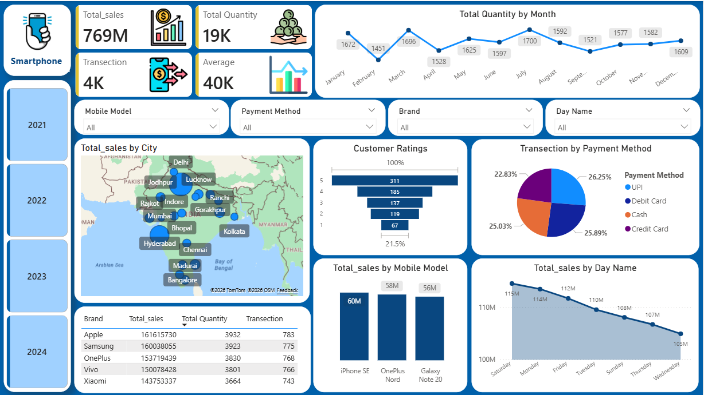

# 📊 Mobile Sales Performance & Forecasting – Power BI  

_📈 Analyzing mobile sales performance, customer behavior, and payment trends to support data-driven retail decision-making using Power BI and DAX._

--- 

## 📌 Table of Contents
- <a href="#overview"> Overview</a>
- <a href="#business-problem"> Business Problem</a>
- <a href="#dataset"> Dataset</a>
- <a href="#tools--technologies"> Tools & Technologies</a>
- <a href="#project-structure"> Project Structure</a>
- <a href="#data-cleaning--preparation"> Data Cleaning & Preparation</a>
- <a href="#research-questions--key-findings"> Research Questions & Key Findings</a>
- <a href="#dashboard"> Dashboard</a>
- <a href="#how-to-run-this-project"> How to Run This Project</a>
- <a href="#final-recommendations"> Final Recommendations</a>
- <a href="#future-scope"> Future Scope</a>
- <a href="#author--contact"> Author & Contact</a>

---

<h2><a class="anchor" id="overview"></a> Overview</h2>

This project focuses on analyzing mobile sales data to generate actionable insights for business growth. An interactive dashboard was developed using Power BI, supported by DAX calculations and a structured data model.  

The solution provides a comprehensive view of sales performance across multiple dimensions such as time, geography, product categories, and payment methods, enabling stakeholders to make informed and data-driven decisions.

---

<h2><a class="anchor" id="business-problem"></a> Business Problem</h2>

In the mobile retail industry, businesses often rely on static and fragmented reporting systems, which limits their ability to gain timely insights. This leads to delays in decision-making and inefficiencies in operations.  

This project aims to:

-  Identify top-performing brands and mobile models  
-  Analyze customer payment behavior (UPI, Credit Card, Cash)  
-  Evaluate time-based sales trends  
-  Understand regional (city-wise) performance  
-  Assess customer satisfaction through ratings  

---

<h2><a class="anchor" id="dataset"></a> Dataset</h2>

- Source: Mobile Sales Dataset (Excel/CSV)  
- ~4,000 transaction records  

**Key Columns:**
- Transaction ID  
- Day & Month  
- City  
- Brand  
- Mobile Model  
- Units Sold  
- Price Per Unit  
- Payment Method  
- Customer Ratings  

---

<h2><a class="anchor" id="tools--technologies"></a> Tools & Technologies</h2>

-  Power BI (Dashboard & Visualization)  
-  DAX (Measures & KPIs)  
-  Data Modeling (Star Schema)  
-  Excel/CSV (Data Source)  
-  GitHub  

```
mobile-performance-analysis/
│
├── README.md
├── data/
│ └── mobile_sales_data.xlsx
│
├── dashboard/
│ └── mobile_sales_dashboard.pbix
│
├── images/
│ └── dashboard_preview.png
│
└── Mobile_Sales_Report.pdf          
│   
```


---

<h2><a class="anchor" id="data-cleaning--preparation"></a> Data Cleaning & Preparation</h2>

-  Removed duplicate transactions using Transaction ID  
-  Handled missing and inconsistent values  
-  Standardized data formats (date and numeric values)  
-  Created calculated metrics such as Total Sales  
-  Validated payment methods and customer ratings  

---

<h2><a class="anchor" id="research-questions--key-findings"></a> Research Questions & Key Findings</h2>

1.  **Top Products:** iPhone SE, Vivo, and Redmi models contribute significantly to sales  
2.  **Payment Trends:** UPI accounts for ~26% of transactions → strong digital adoption  
3.  **Peak Sales Period:** Sales are highest on Saturdays (~115M)  
4.  **Regional Performance:** Metro cities dominate sales; some cities underperform  
5.  **Customer Behavior:** Higher-rated products show better performance  

---

<h2><a class="anchor" id="dashboard"></a> Dashboard</h2>

-  KPI Cards (Sales, Quantity, Transactions, Average Price)  
-  Monthly Sales Trends  
-  City-wise Sales Analysis  
-  Brand & Model Performance  
-  Payment Method Distribution  
-  Customer Ratings Analysis  
-  Day-wise Sales Trends  



---

<h2><a class="anchor" id="how-to-run-this-project"></a> How to Run This Project</h2>

1. Clone the repository:
```bash
git clone [https://github.com/mahimakumari2/mobile-sales-performance-powerbi.git]

```
2. Open Power BI Dashboard:
   - `Dashboard/Sales Dashboard.pbix`

3. Load Dataset:
   - Connect Excel/CSV file if required

4. Explore Dashboard:
   - Use filters for Month, Brand, Payment Method, and Mobile Model
  
---

<h2><a class="anchor" id="final-recommendations"></a> Final Recommendations</h2>

-  Promote digital payments (UPI offers, cashback)
-  Increase inventory and staffing during weekends
-  Focus marketing on high-performing products
-  Improve performance in low-performing regions
-  Use customer feedback to enhance product quality
  
---

<h2><a class="anchor" id="future-scope"></a> Future Scope</h2>

-  Implement sales forecasting models
-  Integrate real-time data sources
-  Perform customer segmentation
-  Deploy dashboard on Power BI Service

---

<h2><a class="anchor" id="author--contact"></a> Author & Contact</h2>

Mahima Kumari
Data Analyst

📧 Email: mahima.kumari0223@gmail.com  
🔗 [LinkedIn](https://www.linkedin.com/in/mahimakumari/)  
🔗 [Portfolio](https://mahimakumari.netlify.app/)
